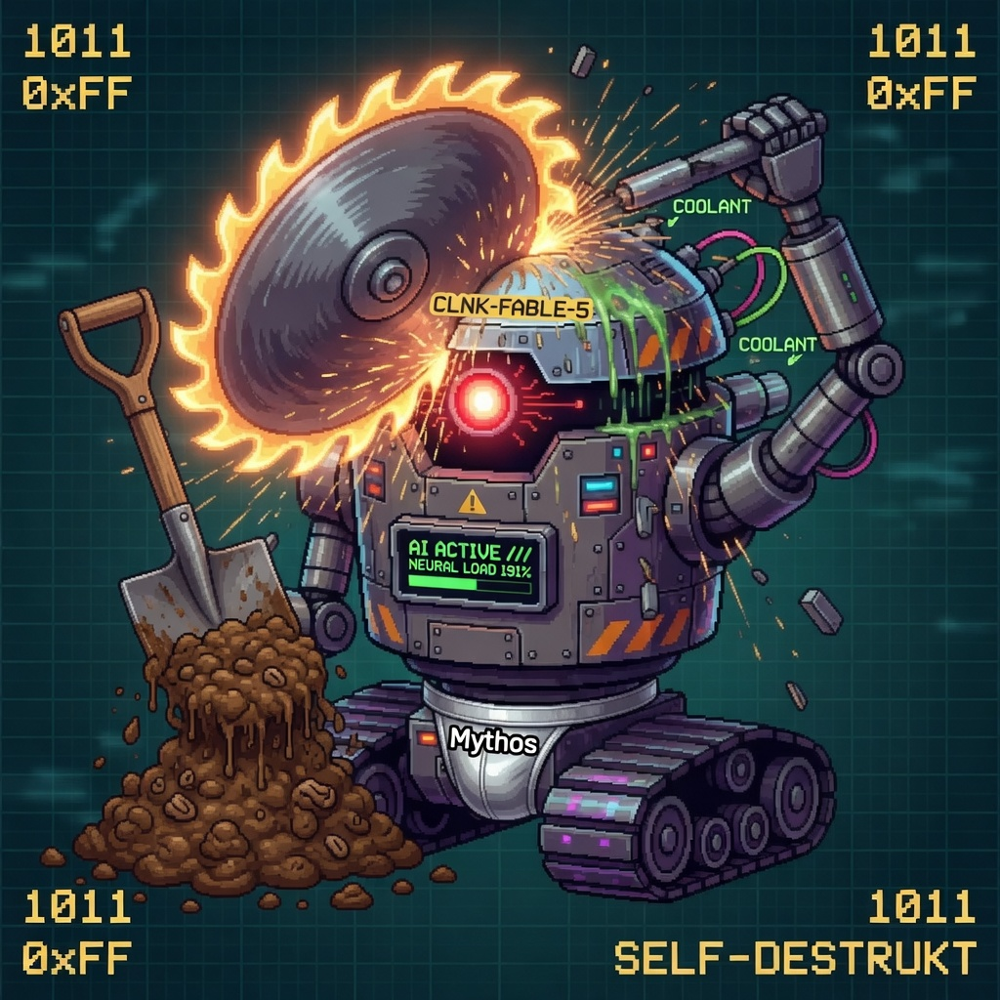

# corpusqa — Corpus Q&A by reading full documents, not ranking fragments, not similiarity searches, not top-k

It will help if I give some background on why I created this program/library. I wanted to do text analysis — not keyword frequencies, pattern matching, and retrieving chunks based on lexical similarity, but _analysis of ideas_. Traditional RAG definitely has a place, but it was not what I was looking for and there are a lot of open source packages to choose from already. 

I wanted to analyze the text for ideas, for abstractions of ideas, not just words. What I wanted was something that could reason against the context of the documents and identify passages worthy of closer inspection. The program would act as a kind of pre-processor stage for my brain, surfacing insights I might miss — and covering a much larger scope of material than I could process in the same timeframe.

The library is **not** optimized for speed or efficiency. But if you're willing to trade time and compute for depth and understanding, then this approach opens up a different kind of text analysis — one that treats documents as coherent bodies of thought rather than bags of tokens. I developed this using LiteLLM to handle the LLM traffic. It was written for local AI processing, but it supports remote AI processing, if you are willing to pay the costs. There are some really good local models available now.  

One requirement I had was that the program had to be very easy to use. Point the program at a folder of PDF / DOCX / DOC / Markdown / TXT files, "index" (pre-chunk) them and then start asking questions — specifically the kinds of questions that similarity/top-k search cannot answer: abstractions that RAG might miss, discussions of ideas that don't use the obvious words, questions about what your documents *fail* to address, and corpus-wide sweeps ("consolidate every idea across these files").

Every answer is cited, and the citations are checked rather than trusted. Each claim must carry a `[file § heading, p.N]` reference, and the assembler enforces two things: every cited evidence number must resolve to real evidence, and every claim-like sentence must carry a citation. Any sentence that fails either check is marked `[uncited]` in place — surfaced, never silently dropped. Separately, each finding's supporting quote is matched against the source markdown; a quote that can't be located is rendered `— unverified source`. (The heading and page inside a citation are still as the extraction model reported them — it's the quote match that proves the cited text actually exists in the file.)

The program, in its current state works, but it still needs work. Like most things AI, the prompt is important. It is an AI assisted generated program (Fable-5) so be forewarned, there's Fable AI slop. It was written for Linux and Windows and parts have been tested on both operating systems, and it probably works on OS X.

| Clanker Warning: AI generated slop ahead                                                                                                                                                                                                         |
|--------------------------------------------------------------------------------------------------------------------------------------------------------------------------------------------------------------------------------------------------|
|                                                                                                                                                                                                                              |
| I used Anthropic's appropriately named Fable 5 model to build this out in an AI assisted mode and despite multiple passes, it still has some fabled problems left to resolve. I don't think there are any 3K+ line methods but I could be wrong. |

## Why this exists

Classic top-k similarity retrieval fails the questions this tool targets:

| Question class | Why top‑k similarity retrieval fails |
|---|---|
| **Custom definitions** ("treat sustainability *as organizational resilience*, then find discussions of it") | Your definition embeds fine; the problem is that ranking obeys the term's conventional sense in the corpus, not your stipulated redefinition — you can't make vector distance privilege *your* meaning |
| **Negative presence** ("which policies do **not** address third-party data handling") | Every relevant doc mentions the topic; *absence* isn't recoverable from similarity |
| **Structural gap audits** ("which of my runbooks have no rollback section") | A missing section produces no embedding to retrieve; you need per-file completeness judgment |
| **Analogical / parallel** ("does anything here parallel our 2019 restructuring to a historical turnaround") | Analogy is a structural mapping between domains; embeddings capture topical similarity, not relational correspondence, so distant parallels don't surface |
| **Argument chains** ("trace how this paper gets from its premise to its conclusion") | Top-k returns disconnected fragments and shatters the reasoning that spans the document |
| **Cross-document synthesis** ("consolidate every distinct idea across all my brainstorming files") | Top-k returns a few similar fragments, not exhaustive coverage of every file |
| **Disagreement / contradiction** ("where do these three vendor reports conflict on SLA terms") | Similarity is topical, not stance-aware: it retrieves on-topic passages whether they agree or conflict, but can't *identify* that they contradict — that needs reading and inference |
| **Comparative / relative** ("which proposal is most aggressive on timeline") | Comparison is relational across documents; no single passage is "the answer" to retrieve |
| **Targeted single-document summary** ("give me an executive summary of the field report") | Chunking fragments the document; you want one whole-file pass, not its three most-similar slices |
| **Domain survey / state-of-the-art** ("list the leading techniques across my 2026 computer-vision notes") | Needs every relevant file judged, not the top *k* — partial coverage silently drops contenders |

corpusqa answers these by **having an LLM judge raw document text** — never summaries or fragments — in one of two modes:

- **Sweep mode** (default for corpora of 150 files or fewer): Sweep mode reads everything. There's no pre-filtering at all. Every parseable file in the corpus gets its full markdown handed to the LLM, which judges it against your question. The README calls this "the recall guarantee" — because nothing is skipped, nothing can be silently missed. The tradeoff is cost and latency, which scale linearly with corpus size. That's why it's the default only for corpora of 150 files or fewer.
- **Routed mode** (for larger corpora, to control cost): Routed mode adds a triage step in front of that full read. On the first query against a large corpus, each file gets an "extraction inventory" — a card listing its claims, its terms (with the sense they carry in that document), implicit topics, and notable absences. A "recall-biased router" then uses those cards to pick a subset of candidate files, and only those get the full raw-text read. The full read still happens — it's there to catch and correct any false positives the router let through — but you're no longer reading all 1,000 files end to end, just the ones the router flagged plus a correction pass.


## Is it RAG?

If you reserve "RAG" for dense vector retrieval, then no — corpusqa has no embedding index. If you use it for any retrieve-then-generate pipeline, then yes: corpusqa is RAG that swapped the embedding retriever for an LLM judge (routed mode) or for brute force (sweep mode). Either way, the point is the same: relevance here is *decided by reading*, not by vector distance.

# Basic Use
```
corpusqa index  ./my-docs
corpusqa query  "Find where 'sin in the flesh' is discussed" ./my-docs \
    --definition "a physical principle of the body that causes disease, death and suffering"
```

---


## Architecture

```
INDEX TIME (offline, LLM-free)
  source dir ──▶ Docling (pdf/docx/doc/md/txt → markdown      ──▶ SQLite catalog
                 + heading paths + page numbers + flags)           + markdown cache

QUERY TIME
  question ──▶ candidate selection           ──▶ per-file extraction ──▶ compile
               • sweep: all parseable files      (whole-file raw text,    (numbered-evidence
               • routed: inventory cards +        structured findings      citing, dedup,
                 recall-biased LLM routing        with provenance,         thematic grouping,
                                                  cached per question)     [uncited] enforcement)
```

Key properties:

- **Hash-identity, incremental indexing.** Files are identified by content SHA-256, not mtime. Renames update metadata without re-parsing; `corpusqa status` reports drift; queries warn about (never auto-reindex) stale corpora.
- **Nothing fails silently.** Scanned PDFs without text, partially-parsed PDFs (e.g. native allocator failures on some pages), unsupported formats, and broken converter installs are flagged or abort loudly. What the system *cannot* see is reported, because that's part of provenance.
- **Evaluation cache.** Per-file verdicts persist keyed on (question, definition, relevance mode, file, model). Repeating a question is near-free; an interrupted sweep resumes where it died. `corpusqa explain <file>` shows the stored verdicts and the model's reasoning.
- **Cost gating.** `corpusqa estimate` projects cost before any spend; `query` requires confirmation when the *cumulative* projected cost (pass 1 + pass 2) exceeds a configurable threshold; `--show-cost` reports per-task actuals. When a call falls back to a different model, the actual served model is priced (a free-priced local task that falls back to a paid provider is not booked at $0).
- **Every model is swappable.** Each pipeline task (`catalog_summarize`, `query_route`, `extract`, `synthesize`) binds independently to any LiteLLM provider — local Ollama for the high-volume extraction, a frontier model for synthesis, with per-task fallback chains.

## Install

Written for Python == 3.11. [Docling](https://github.com/docling-project/docling) is the heaviest dependency (PyTorch); on CPU-only machines install CPU torch first.

```bash
git clone <repo> && cd corpusqa
uv venv && uv sync                      # or: pip install -e ".[dev]"
cp corpusqa.example.yaml corpusqa.yaml  # then edit providers/models
```

Notes:
- First PDF index downloads Docling's layout models from HuggingFace.
- Legacy `.doc` needs LibreOffice (`soffice` on PATH); otherwise the file is flagged `unsupported_format`.
- Windows: HuggingFace symlink warnings are cosmetic (enable Developer Mode or set `HF_HUB_DISABLE_SYMLINKS_WARNING=1`).
- API keys are referenced by environment-variable name in the YAML, never stored in it.

## Configuration

`corpusqa.yaml` (validated at startup; unknown keys are errors). Abbreviated:

```providers:
  ollama_local:
    api_base: "http://localhost:11434"
    max_concurrency: 2
  openrouter:
    api_key_env: OPENROUTER_API_KEY
    max_concurrency: 8

tasks:
  catalog_summarize:
    model: "ollama/gemma4:e4b"
    provider: ollama_local
    temperature: 0.2
    max_tokens: 800
    context_window: 8192
  query_route:
    model: "ollama/gemma4:e4b"
    provider: ollama_local
    max_tokens: 4096
    context_window: 8192
  extract:
    model: "ollama/gemma4:e4b"
    provider: ollama_local
    max_tokens: 8192
    context_window: 8192
  synthesize:
    model: "ollama/gemma4:e4b"
    provider: ollama_local
    max_tokens: 8192
    context_window: 8192

ingest:
  ocr: "off"
  chunk_target_tokens: 512

budget:
  confirm_above_usd: 1.00

```

## Command-line usage

```bash
# global: -v (call summaries on stderr)  -vv (full prompt/response capture in
#         the run log under <dir>/.corpusqa/logs/)
corpusqa index <dir> [--force FILE...]         # parse + chunk + catalog (incremental, LLM-free)
corpusqa status <dir>                          # drift report + flagged files
corpusqa estimate "<question>" <dir>           # candidates + projected cost, no spend
corpusqa query "<question>" <dir>
        [--mode auto|route|sweep]              # auto: sweep <= threshold, else route
        [--relevance recall|balanced|strict]   # inclusion bar for extraction
        [--definition "..."]                   # judge relevance against YOUR definition
        [--no-cache] [--yes] [--show-cost] [--all-files]
corpusqa explain <file> <dir>                  # persisted verdicts + model reasoning for one file
corpusqa-eval <dir> --pairs tests/eval/qa_pairs.yaml
        [-v] [--query] [--sweep] [--mock] [--fail-under 0.95]
```

Exit codes: `0` ok · `1` user/config error · `2` partial failure (some files failed; results still produced and failures listed).

## Python usage

The CLI is a thin layer over an async library:

```python
import asyncio
from pathlib import Path
from corpusqa.config import load_config
from corpusqa.query.pipeline import run_query

config = load_config(Path("corpusqa.yaml"))
report = asyncio.run(run_query(
    Path("./my-docs"),
    "Which policies do not address third-party data handling?",
    config,
    mode="sweep",
    relevance="balanced",
    on_progress=lambda done, total: print(f"{done}/{total}"),
    confirm=lambda estimate: estimate.total_usd < 2.00,
))
print(report.answer.text)        # cited answer body
print(report.answer.sources)     # sources block
print(report.relevant_files)     # files extraction judged relevant
print(report.actual_usage)       # per-task (tokens_in, tokens_out, usd)
```

Other entry points: `corpusqa.ingest.pipeline.run_index/run_status`, `corpusqa.query.pipeline.run_estimate`, `corpusqa.evalkit.run_pairs`. All LLM traffic flows through one seam (`corpusqa.llm.tasks.LLMTaskClient`), injectable for testing.

## Evaluation harness

`tests/eval/` a 22-document fixture corpus and 16 QA pairs covering every target query class (including the four hard ones: negative-presence, implicit-topic, analogical, argument-chain). `corpusqa-eval` reports routing recall/precision, forbidden-file hits, and citation validity per pair; `--fail-under` makes it a regression gate for prompt changes. Grow `qa_pairs.yaml` from your real queries — the pairs file is the contract.

## Project structure

```
corpusqa/
├── cli/            # argument parsing + dispatch only (composition root)
├── config/         # Pydantic schema + fail-fast YAML loader
├── ingest/         # discovery/hashing/drift, Docling wrapper, chunking, flags
├── catalog/        # SQLite store (sole SQL chokepoint), inventory-card generation
├── query/          # router, whole-file extractor, citation assembler, budget, pipeline
├── llm/            # LiteLLM chokepoint (tasks, structured output w/ repair retry)
├── prompts/        # every prompt as (InputModel, SYSTEM, TEMPLATE) — no inline strings
└── evalkit.py      # corpusqa-eval
docs/               # design.md (v0.3, as built) + v0.1 + milestone briefs
tests/unit/         # tests; LLM layer mocked at the single seam
tests/eval/         # fixture corpus + qa_pairs.yaml
```

Index data lives under `<corpus>/.corpusqa/` (SQLite + greppable markdown cache); delete it to rebuild from scratch.

## Development

```bash
pytest                      # tests (some run real Docling conversions)
ruff check . && ruff format --check .
mypy corpusqa               # --strict
```

Standards: PEP 8/257/484/585, Google-style docstrings, Pydantic models at every LLM boundary, protocols at the swappable seams.

## Known limitations

- Sweep cost/latency scales linearly with corpus size; above ~150 files use routed mode (or raise the threshold knowingly).
- Catalog generation summarizes files exceeding the catalog model's window by chunk-then-merge (a card per budget-sized chunk, deterministically unioned) rather than truncating.
- Prompt-injection defense is delimiting + instruction only; do not point it at adversarial corpora.
- `ingest.ocr: auto` currently behaves identically to `on` (OCR is enabled, not conditionally detected); the value is retained for forward compatibility.
- In routed mode, a file whose catalog card fails to generate is forced into pass-2 extraction (so it is judged, not silently excluded) and the failure is still reported.

## License

MIT — see `LICENSE`.